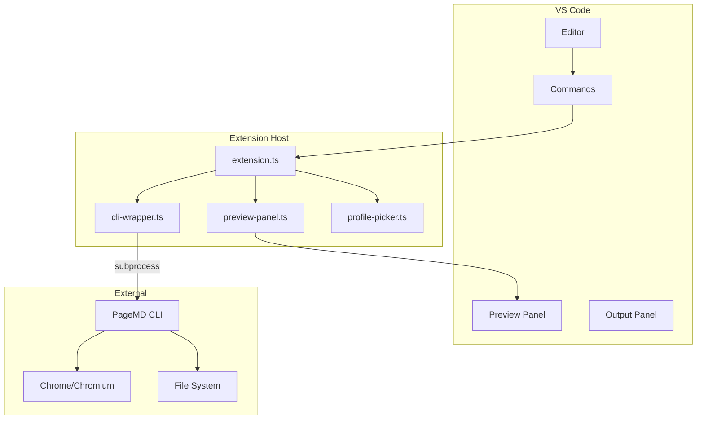
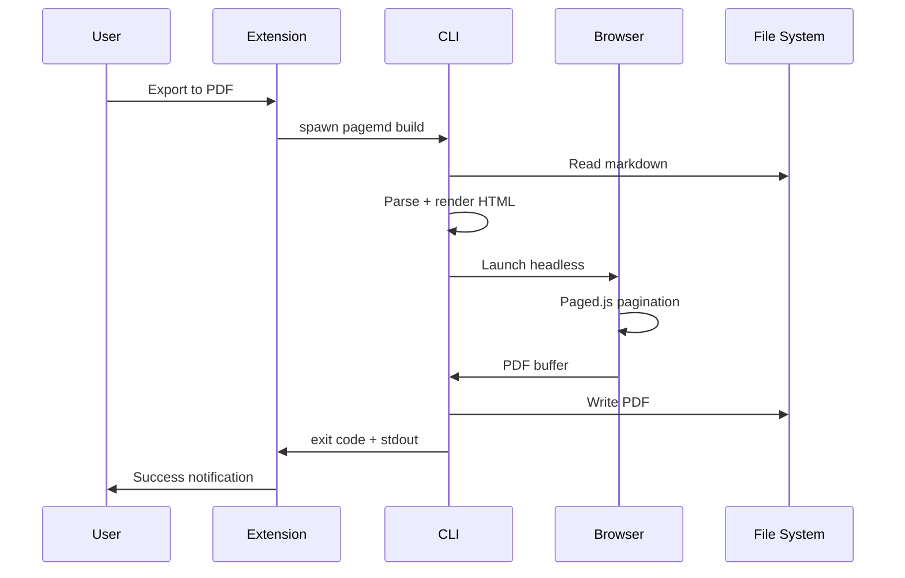
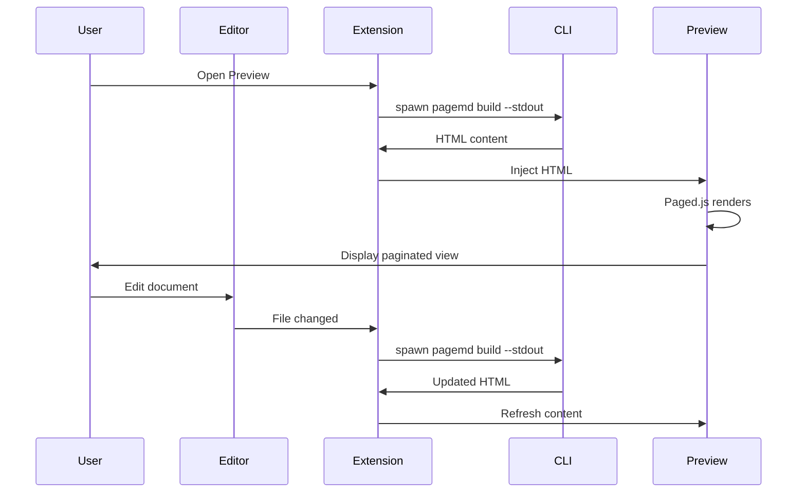

# Architecture

Technical architecture of the PageMD VS Code extension.

---

## Contents

- [Overview](#overview)
- [Component Diagram](#component-diagram)
- [Data Flow](#data-flow)
- [Extension Structure](#extension-structure)
- [CLI Integration](#cli-integration)
- [Preview Panel](#preview-panel)
- [Design Decisions](#design-decisions)

---

## Overview

The PageMD VS Code extension follows a thin-client architecture:

- **Extension** handles UI, commands, and user interaction
- **CLI** handles all rendering, validation, and processing
- **Communication** via subprocess (stdin/stdout)

This separation ensures:

1. Identical output between CLI and extension
2. Extension stays lightweight (~50KB)
3. Updates to rendering logic don't require extension updates

---

## Component Diagram



---

## Data Flow

### Export Flow



### Preview Flow



---

## Extension Structure

```
pagemd-vscode/
├── src/
│   ├── extension.ts          # Entry point, command registration
│   ├── commands/
│   │   ├── export-pdf.ts     # Export to PDF command
│   │   ├── export.ts         # Export Document... command
│   │   ├── preview.ts        # Open Paged Preview command
│   │   ├── select-profile.ts # Select Profile command
│   │   ├── validate.ts       # Validate Document command
│   │   ├── create-document.ts# Create Document... command
│   │   └── inspect.ts        # Inspect Document command
│   ├── providers/
│   │   ├── preview-panel.ts  # Webview panel for preview
│   │   └── profile-picker.ts # QuickPick for profile selection
│   └── utils/
│       ├── cli-wrapper.ts    # CLI subprocess management
│       └── webview-utils.ts  # HTML injection utilities
├── media/
│   ├── paged.polyfill.js     # Paged.js runtime (~900KB)
│   └── previewer.js          # Preview controller (~14KB)
└── scripts/
    └── bundle-cli.js         # CLI bundling script
```

### File Sizes

| Component | Size | Purpose |
|-----------|------|---------|
| Extension code | ~50KB | Commands, providers, utils |
| Paged.js polyfill | ~900KB | In-browser pagination |
| Previewer script | ~14KB | Preview zoom, controls |
| Bundled CLI | ~2MB | PageMD rendering pipeline |

---

## CLI Integration

### CLI Wrapper

`cli-wrapper.ts` manages all CLI interactions:

```typescript
class CLIWrapper {
  // Find CLI executable
  async findCLI(): Promise<string>

  // Spawn CLI process
  async run(args: string[]): Promise<CLIResult>

  // Stream output to channel
  async runWithOutput(args: string[], channel: OutputChannel): Promise<void>
}
```

### CLI Resolution Order

The wrapper searches for the CLI in this order:

1. **Custom path** - `pagemd.cliPath` setting
2. **Bundled CLI** - `<extension>/cli/node_modules/.bin/pagemd`
3. **Workspace local** - `./node_modules/.bin/pagemd`
4. **Global npm** - `npm root -g` + `/pagemd/apps/cli/src/index.js`
5. **npx fallback** - `npx pagemd`

### CLI Commands Used

| Extension Action | CLI Command |
|-----------------|-------------|
| Export to PDF | `pagemd build <file> -o pdf` |
| Export to HTML | `pagemd build <file> -o html` |
| Preview | `pagemd build <file> -o html --stdout` |
| Validate | `pagemd validate <file>` |
| Inspect | `pagemd inspect <file> --json` |
| List profiles | `pagemd list profiles --json` |

---

## Preview Panel

### Webview Architecture

The preview uses VS Code's Webview API:

```typescript
class PreviewProvider {
  // Create webview panel
  createPanel(): vscode.WebviewPanel

  // Update content
  updateContent(html: string): void

  // Handle messages from webview
  onMessage(message: any): void
}
```

### Preview HTML Structure

```html
<!DOCTYPE html>
<html>
<head>
  <meta charset="UTF-8">
  <meta name="viewport" content="width=device-width, initial-scale=1.0">
  <style>/* Preview styles */</style>
</head>
<body>
  <div id="toolbar">
    <button id="zoom-out">−</button>
    <span id="zoom-level">100%</span>
    <button id="zoom-in">+</button>
    <button id="zoom-fit">Fit</button>
  </div>
  <div id="preview-container">
    <!-- Rendered HTML injected here -->
  </div>
  <script src="${pagedPolyfill}"></script>
  <script src="${previewer}"></script>
</body>
</html>
```

### Paged.js Integration

1. CLI generates unpaginated HTML
2. Preview injects Paged.js polyfill
3. Polyfill runs `window.PagedPolyfill.preview()`
4. DOM is paginated into `<div class="pagedjs_page">` elements

---

## Design Decisions

### Why Subprocess?

**Decision:** Use CLI subprocess instead of embedding pipeline

**Rationale:**

- Output consistency between CLI and extension
- Extension stays lightweight
- CLI updates don't require extension republishing
- Easier debugging (CLI can be tested independently)

### Why Bundled Paged.js?

**Decision:** Bundle Paged.js locally instead of CDN

**Rationale:**

- Works offline
- Consistent version across users
- No external network dependencies
- Faster load times

### Why No extendMarkdownIt?

**Decision:** Don't override VS Code's built-in Markdown preview

**Rationale:**

- Users may prefer built-in preview for quick viewing
- Avoids conflicts with other Markdown extensions
- Paged preview is opt-in for when pagination matters

### Why --stdout for Preview?

**Decision:** Use `--stdout` flag instead of temp files

**Rationale:**

- Faster (no disk I/O)
- No temp file cleanup needed
- Direct streaming to webview
- Works in read-only workspaces

---

## See Also

- [[Developer-Guide]] - Building the extension
- [[Introduction]] - Extension overview
- [PageMD CLI Architecture](../../pagemd/docs/wiki/Architecture.md)
